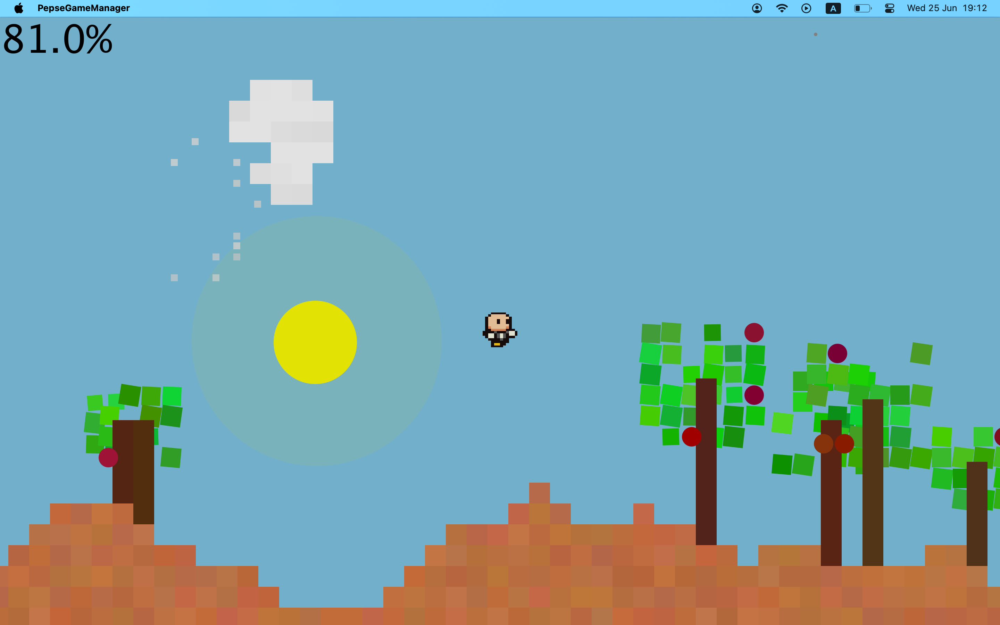

# PEPSE - A 2D Platformer Game

**Short description:**  
Environmental Procedural Simulator, Super-Mario-like-style built in Java. It features a dynamic world with a day-night cycle, terrain, trees, and clouds. The player controls an avatar that can eat fruits, run and jump through this world.

## Features
- 🔧 **Dynamic 2D World:** The game generates a world with a sky that changes from day to night, terrain to traverse, and flora.
- ⚙️ **Java-Based:** The entire game is developed using Java, showcasing object-oriented programming principles for game development.
- 🎯 **Expandable Game Engine:** The project is designed to be a simple and expandable 2D platformer game engine, allowing for the addition of new features and game elements.

## Demo / Screenshot


## Getting Started
Note: This project is build upon DanoGameLab library which was provided during OOP course in the Hebrew University of Jerusalem. I have uploaded it to this repo, but you will probably will have to install it independently.

After installing DanoGameLab, Clone the repo and run:

```bash
git clone https://github.com/ronlevin1/PEPSE
cd PEPSE
# To run the project, compile and run the main class:
javac pepse/PepseGameManager.java
java pepse.PepseGameManager
```
